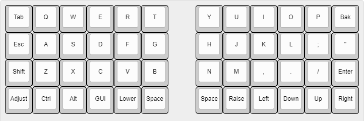
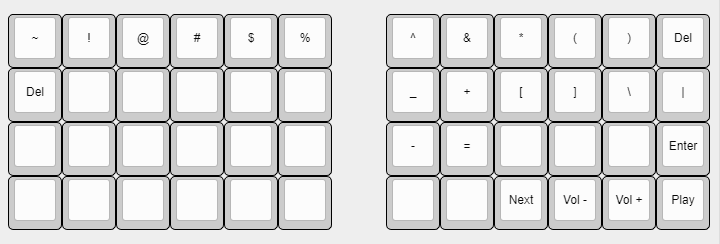
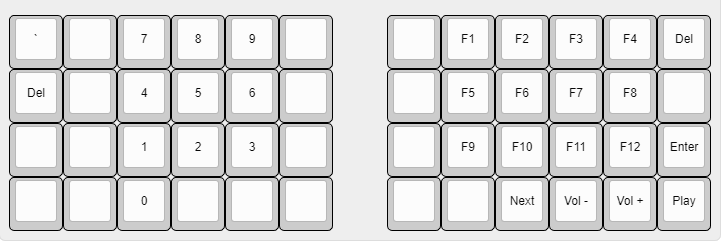

<h2>Introduction</h2>

```
Semelparity and iteroparity are two contrasting reproductive strategies available to living organisms. A species is considered semelparous if it is characterized by a single reproductive episode before death, and iteroparous if it is characterized by multiple reproductive cycles over the course of its lifetime.
```
```
> producing only once in a lifetime
```

<p>Simply put, this keyboard that i made is the last and endgame for me.</p>

<h2>Pre·requisite</h2>
Since i'm cheap and don't wanna going to deep in this keyboard rabbit hole, there is some requirement for my end game keyboard.
<br><br>
• 40% Ortholinear Split
<br>
• Sandwich Case (Top and Bottom Plate Only)
<br>
• 5mm Thick Acrylic Plate
<br>
• Handwired
<br>
• Hotswap Pins (So i can resell the switch)
<br>
• Linear Switch ±35g
<br>
• XDA Profile Keycaps
<br>
• Preferably KMK Firmware Based 

<h2>Part List</h2>
<table>
    <tr>
        <td>Component</td>
        <td>Quantity</td>
    </tr>
    <tr>
        <td>Semelparous40 Top Plate</td>
        <td>2</td>
    </tr>
    <tr>
        <td>Semelparous40 Bottom Plate</td>
        <td>2</td>
    </tr>
    <tr>
        <td>Raspberry Pi Pico (RP2040)</td>
        <td>1</td>
    </tr>
    <tr>
        <td>1N4148 Diode</td>
        <td>48</td>
    </tr>
    <tr>
        <td>Kailh Hot-Swap Socket</td>
        <td>48</td>
    </tr>
    <tr>
        <td>Akko CS Jelly White Switch</td>
        <td>48</td>
    </tr>
    <tr>
        <td>XDA Sushi Japanese Root PBT Keycaps</td>
        <td>1 set</td>
    </tr>
</table>

<h2>Layout</h2>
<h3>Qwerty</h3>

<h3>Lower</h3>

<h3>Raise</h3>


<h2>Updates</h2>
-